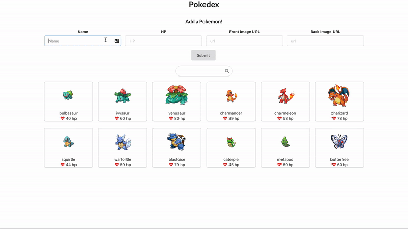

# Personal Pokedex

In this assignment, you will build a React front-end application for browsing your collection of pokemon. You can view the pokemon you've already "caught", add new pokemon to your collection, and filter pokemon. In this app, you will practice:
* Using `useState` to manage the various pieces of state in your application
* Using the React Context API to establish global state values
* Using `useEffect` and `fetch` to read from a dummy API
* Creating controlled components
* Handling click events



**Table of Contents**
- [Short Responses](#short-responses)
- [Technical Checklist](#technical-checklist)
- [Set Up](#set-up)
  - [JSON Server API](#json-server-api)
- [Steps For Completing The First Feature In Assignment:](#steps-for-completing-the-first-feature-in-assignment)
  - [1. Create the context](#1-create-the-context)
  - [2. Complete the Provider component](#2-complete-the-provider-component)
  - [3. Wrap the App in the provider](#3-wrap-the-app-in-the-provider)
  - [4. Fetch Pokemon Data](#4-fetch-pokemon-data)
  - [5. Test](#5-test)
  - [6. Use the Context](#6-use-the-context)
  - [7. Fix the `PokemonCard`](#7-fix-the-pokemoncard)
- [You're on your own now](#youre-on-your-own-now)
  - [A Reminder About POSTing](#a-reminder-about-posting)
  - [Bonus:](#bonus)

## Short Responses

Tired of hearing this yet? Do them first!

## Technical Checklist

There are 11 tasks to complete and 1 bonus.

Your goal is to meet at least 75% of these requirements to complete the assignment. But don't stop there! Shoot for 100%!

**Functionality**
- [ ] On load of the page, a user see a list of pokemon cards displaying each pokemon's name, front sprite, and HP level.
- [ ] A user can click on a pokemon card to toggle seeing its front sprite or back sprite.
- [ ] A user can use the search bar to filter pokemon by name.
- [ ] A user can fill out and submit the form to create a new pokemon. This will display the new pokemon on the page and the new pokemon data should persist, even after the page is refreshed. This means you'll have to make a POST request to our JSON Server API!
- [ ] Bonus: A user can additionally filter pokemon by HP

**React Fundamentals**
- [ ] `useState` is used to manage state. This is done in the Context Provider file at least once.
- [ ] `useEffect` is used to perform an asynchronous fetch call. This is done in the Context Provider file at least once.
- [ ] The form must be a controlled component. The `value` prop of the `input` elements should be set to a state value and `onChange` should update that state value.
- [ ] The project uses React Context.
- [ ] The project uses `useContext` at least once

**Miscellaneous**
- [ ] Props are extracted in child components using destructuring
- [ ] At no point did you ever use any vanilla DOM JS methods (e.g. `document.querySelector` or `document.createElement`)

**Note:** We are requiring you use React Context for this assignment, however it does not mean that Context is necessarily the right tool for this job. For a project this small, Context may not be the best solution. However, for now, use it!

## Set Up

Make sure you `cd` into the project directory.

In one terminal, run `npm install` to set up dependencies. Then run `npm run dev` to start the React App. This is your Front-End.

In another terminal, run `npm i -g json-server` to globally install the `json server` CLI tool (if you don't already have it).

> If you can't install `json-server` globally, install it locally by removing the `-g` flag.

Then, run `npx json-server db.json --port 4000` to start a mock back-end server on port 4000. Now, you will have a RESTful API that you can access via the URL `http://localhost:4000/pokemon`.


### JSON Server API

JSON Server is a tool to we use to spin up a mock API. It is a great alternative when you don't have the time to build out a full Express API. It does have its limitation in that it cannot support a robust relationships database. Read the [JSON Server documentation](https://github.com/typicode/json-server#getting-started) for more information.

You will be using the API endpoint `http://localhost:4000/pokemon` for sending both GET and POST requests. 
* When sending a GET request, you will receive the `pokemon` JSON data in the `db.json` file.
* When sending a POST request, the request body will be added to `pokemon` array in that same file.

## Steps For Completing The First Feature In Assignment:

We'll walk through the process of fetching pokemon data and providing it via context to the entire application.

### 1. Create the context

For this project, we want to fetch an array of `allPokemon` objects and share that data throughout the entire application. Context to the rescue!

Open up the `src/context/PokemonContext.jsx` file. This is where you'll create your context and export it.

This file is boilerplate (its _mostly_ the same in every project) so we will give it to you for free!

```jsx
// PokemonContext.jsx
import { createContext } from "react";

const PokemonContext = createContext();

export default PokemonContext;
```

We simply create the `PokemonContext` so that it may be used throughout our application. This `PokemonContext` object will serve as the "glue" connecting our `PokemonContext.Provider` with the components that use the context (`useContext(PokemonContext)`)

### 2. Complete the Provider component

Open up the `src/context/PokemonProvider.jsx` file. We've started things for you but you have to finish it.

This is where you will:
- Create and export the `PokemonProvider` component that will wrap around your entire application.
- Create the state values / setter functions in your application
- Make your fetch calls

You'll regularly return to this file as you build the features of this application.

1. Start by importing the `PokemonContext` you just created.
2. Then, return a `PokemonContext.Provider`, making sure to wrap the `children` prop.
3. Set `value` prop on the `PokemonContext.Provider` to `contextValues`.
4. Add the `allPokemon` and `setAllPokemon` state values to the `contextValues` object.

As you add more state values to the context, you'll add those values to `contextValues`

Check out this example for reference:

```jsx
import { useState } from 'react';
import CountContext from './CountContext';

const CountContextProvider = ({children}) => {
  const [count, setCount] = useState(0);
  const [otherState, setOtherState] = useState(null);

  const contextValues = { count, setCount, otherState, setOtherState }

  return (
    <CountContext.Provider value={contextValues}>
      {children}
    </CountContext.Provider>
  )
}
```

### 3. Wrap the App in the provider

Open up the `main.jsx` file. Here is where you'll wrap the entire `App` component in the `PokemonProvider` you just created.

1. Import the `PokemonProvider` component.
2. Render the `PokemonProvider` component such that it fully wraps the `App` component

Here is a generic example:

```jsx
return (
  <Provider>
    <App />
  </Provider>
);
```

### 4. Fetch Pokemon Data

To populate the data in the `allPokemon` array with "real" data, we need to fetch from the JSON server database that you should have up and running. If you don't have it running yet, run

```sh
npm i -D json-server # skip this if you have json-server already installed
json-server db.json --port 4000
```

To help you out, we've already imported the `handleFetch` helper function defined in the `src/utils/handleFetch.js` file.

Then, do the following in your `PokemonProvider`:

1. Import `useEffect`
2. Invoke `useEffect` with a callback that fetches from your local JSON server API which should have the URL `"http://localhost:4000/pokemon"`.
3. If data is returned, it should update the `allPokemon` state value.
4. Make sure that this effect only runs once when the application first renders.

If this worked properly, your `PokemonProvider` will re-render with the new `allPokemon` values provided.

### 5. Test

Before you move on, we should test to make sure that we're properly fetching the data!

Add a `console.log(pokemon)` statement to your `PokemonProvider` so that each time the provider component re-renders it prints out the current `allPokemon` state. You should see the `starterPokemon` appear first, followed by the fetched pokemon.

**Q: Why do you see two console logs instead of just the fetched data?**

### 6. Use the Context

At this point, your context should be shared throughout the entire application. Now its time to use it!

In `PokemonCollection`, the component is trying to render an array of `allPokemon`, but that value is currently hard-coded as an empty array.

Instead, get the `allPokemon` from the `PokemonContext`!.

Save your code, run your dev server, and you should see 12 rendered `PokemonCard` components. They won't have any data but we'll fix that next.

If this didn't see the blank `PokemonCard` components, go back through the first 5 steps before moving on.

### 7. Fix the `PokemonCard`

Open up the `src/components/PokemonCard` file and you'll see that there is a structure provided for you, but the content is incomplete. Each `PokemonCard` should display the front image of the pokemon, their name, and their HP (health points).

The data for these cards are not properly hooked up yet so you will need to work in the `src/components/PokemonCollection` file to pass the appropriate props to each card, and render the pokemon data in the card.

You should now see all of your pokemon cards appear with data!

## You're on your own now

At this point, we've practiced using context, `useEffect`, `useState`, and props. You're more than equipped to implement the remaining features on your own.

You got this!

See below for some tips or [⬆ jump back to the top ⬆](#technical-checklist) to see the remaining items on the technical checklist.

### A Reminder About POSTing
* When POSTing, you will need to include a `Content-Type: application/json` header.
* For the `body` of the request, see the data structure of the existing pokemon in `db.json` as an example of what to include in the `body`.
* See the example below of sending a POST request with `fetch` and an `options` object.

```js
const exampleOptions = {
  method: "POST",
  headers: {
    "Content-Type": "application/json",
  },
  body: JSON.stringify({ key: "value" }),
};
const url = "http://example.com/api";
const response = await fetch(url, exampleOptions);
const data = await response.json();
```

When posting new pokemon to the database, you'll need to include sprites for the front and back of the pokemon.

You can find pokemon sprites in this [GitHub Repo](https://github.com/PokeAPI/sprites/tree/master/sprites/pokemon). But you should use the raw URL. For example:

- `https://raw.githubusercontent.com/PokeAPI/sprites/master/sprites/pokemon/<filename>.png`
- `https://raw.githubusercontent.com/PokeAPI/sprites/master/sprites/pokemon/back/<filename>.png`

### Bonus:

Add a feature to **additionally** filter pokemon by the HP amount. You can use any type of input, but we recommend using a [range input](https://developer.mozilla.org/en-US/docs/Web/HTML/Element/input/range). For example, if the user sets the range value to 50, then only show pokemon with an HP value _equal to or over_ 50. Remember to store that value of the input in state!

[⬆ Jump back to the top ⬆](#technical-checklist)!
